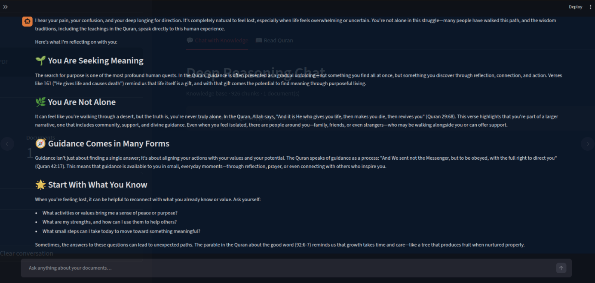

# QRAG — Deep Reasoning Knowledge Chat

A local RAG (Retrieval-Augmented Generation) system that lets you upload large PDF libraries and have deep, reasoning-based conversations with the entire knowledge base — like talking to a knowledgeable friend who has read everything.



## About the Knowledge Base

The default knowledge base is the **Quran** — specifically the *ClearQuran* English translation by **Talal Itani**.

| Detail | Info |
|---|---|
| Edition | ClearQuran (Edition A — uses "Allah") |
| Translator | Talal Itani |
| Pages | 254 |
| Surahs | 114 |
| Language | Modern English |
| File | `PDF_Data/quran-english-translation-clearquran-edition-allah.pdf` |

The Quran PDF is included in the repository so the system works immediately after cloning — no separate download needed. Just index it from the sidebar and start chatting.

> You can also add any additional PDFs (tafsir, Islamic books, etc.) through the sidebar upload.

## Features

- Quran reader built-in: browse all 114 surahs page by page with surah navigation
- Upload any number of PDFs (tens of thousands of pages supported)
- Reasoning model synthesises across the **whole** knowledge base — not just the nearest match
- Persistent vector store: re-index is skipped for already-processed files
- Streaming responses with visible reasoning chain
- Source citations with document name, page number, and relevance score
- Conversation memory across turns

## Models used

| Role | Model |
|---|---|
| Reasoning LLM | `deepseek-r1:8b` |
| Embeddings | `nomic-embed-text` |
| Vector DB | ChromaDB (local, persistent) |

## Requirements

- [Ollama](https://ollama.com) installed and running
- Python 3.10+
- GPU recommended (tested on RTX 4060 Ti 16 GB) — CPU works but is slower

## Setup

```bash
# 1. Clone
git clone <your-repo-url>
cd QRAG

# 2. Pull Ollama models
ollama pull deepseek-r1:8b
ollama pull nomic-embed-text

# 3. Create virtual environment and install dependencies
python3 -m venv .venv
source .venv/bin/activate        # Windows: .venv\Scripts\activate
pip install -r requirements.txt

# 4. Launch
streamlit run app.py
```

Open [http://localhost:8501](http://localhost:8501) in your browser.

## Quick start (after setup)

```bash
./start.sh        # Linux / macOS
```

Or manually:

```bash
source .venv/bin/activate
streamlit run app.py
```

## Usage

1. Drag and drop one or more PDF files into the sidebar
2. Wait for indexing to complete (progress shown per file)
3. Type your question in the chat box
4. The system retrieves the 30 most relevant chunks from the entire knowledge base, reranks them, and passes the best 12 to DeepSeek-R1 for deep reasoning
5. Source citations are shown below each answer

## Project structure

```
QRAG/
├── app.py                  # Streamlit UI (chat + Quran reader tabs)
├── rag_engine.py           # PDF extraction, vector store, reasoning RAG
├── start.sh                # Convenience launch script
├── PDF_Data/
│   └── quran-english-translation-clearquran-edition-allah.pdf
├── assets/                 # Screenshots
├── requirements.txt
└── .gitignore
```

## Configuration

Key constants in `rag_engine.py`:

| Constant | Default | Description |
|---|---|---|
| `CHUNK_SIZE` | 1200 | Characters per chunk |
| `CHUNK_OVERLAP` | 200 | Overlap between chunks |
| `TOP_K_INITIAL` | 30 | Chunks retrieved from vector DB |
| `TOP_K_RERANK` | 12 | Chunks passed to LLM |
| `CHAT_MODEL` | `deepseek-r1:8b` | Swap for any Ollama model |
| `EMBED_MODEL` | `nomic-embed-text` | Embedding model |
